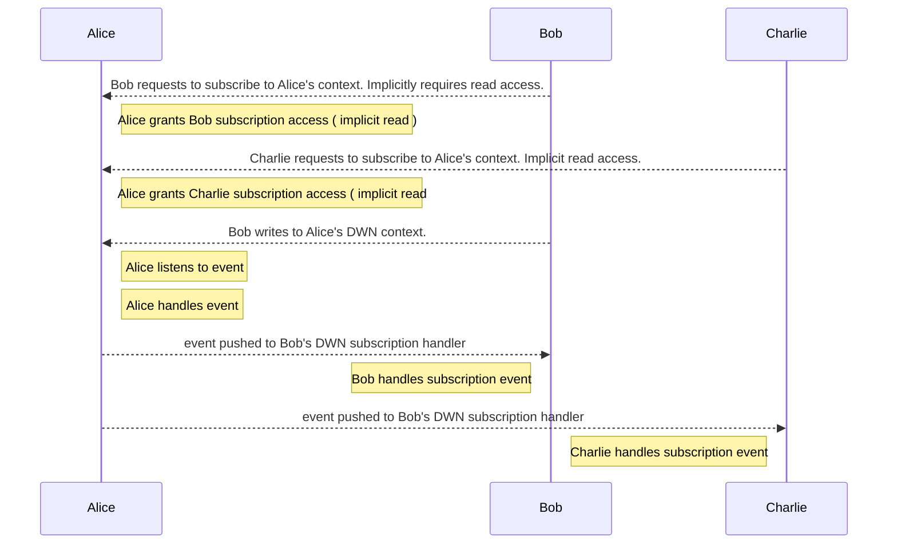
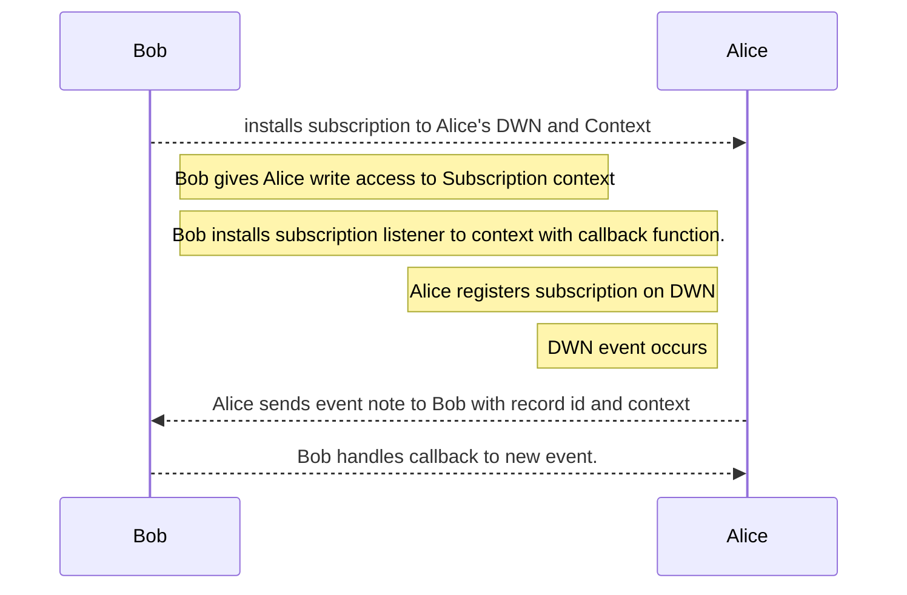
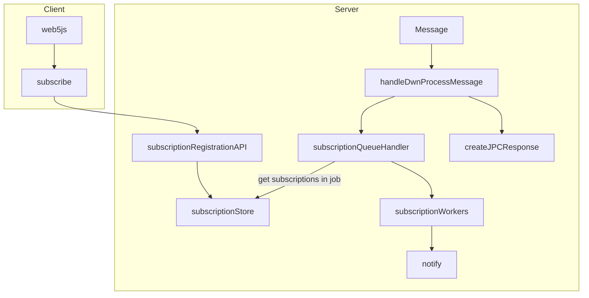

# TP19 Subscription Functionality

```yaml
TP: 19
Title: TP19 - Subscription Functionality
Authors: Andor Kesselman (@andorsk)
Comments URI: https://github.com/TBD54566975/technical-proposals/discussions/6
Status: Proposed
Created: August 16, 2023
Updated: August 16, 2023
```

## Problem Statement

In the context of a Distributed Web Node (DWeb Node or DWN), the goal is to
provide a seamless and responsive user experience for both local and remote
subscriptions. This involves enabling users to subscribe to DWN instances,
whether owned by themselves or by others.

**Example:**

Consider a chat application utilizing DWeb Nodes. When a user sends a message to
a DWeb Node, all participants should receive notifications about the new message
and be able to retrieve a unique recordId associated with the newly created
record. This should have minimal latency, and be handled by a "push" rather than
"pull" mechanic. 

This problem aims to ensure that subscribing to both local and remote DWeb Nodes
is user-friendly and functional, facilitating real-time interactions and data
retrieval.


```mermaid 
%%{
  init: {
    'theme': 'base',
    'themeVariables': {
      'primaryColor': '#5097E6',
      'background': '#fff',
      'primaryTextColor': 'black',
      'primaryBorderColor': 'black',
      'lineColor': 'black',
      'secondaryColor': 'white',
      'tertiaryColor': '#fff'
    }
  }
}%%
graph TD
  subgraph Thread
      subgraph messages 
        subgraph existingMessages
         A1(A1)
         A2(A2)
         A3(A3)
        end
         A4(A4)
      end
      subgraph Participants
          Alice(Alice)
          Bob(Bob)
          Charlie(Charlie)
          Mallory(Mallory)
      end
  end
  
  Charlie -->|sends message| A4
  A4 .->|notifies| Alice
  A4 .->|notifies| Bob
  A4 .->|notifies| Mallory
  ```

In this case, all participants have the full thread context installed on their DWN. 

### Modeling the Problem

We define $N$ as the nodes in the network. $C$ is an attached context for which each record $r_n$ in the set of records $\{r_0, r_1, ..., r_n\}\in{R}$ for which $N$ is subscribed to.

We subset the spaces into two disjoint sets. $R_0$, which contains all synced events to a DWN context and $R_1$, which contains the set of new incoming events not yet synced. We define the $latency$ or $l_n$ as the time between the first write event to $C$ for $r_n$ and the time it takes to propogate the write to the rest of the thread contexts. 

Unlike normal sync, which is scoped to improve latency for $R$, we confine the problem statement to only reducing latency for $R_1$.

The goal of the subscriptions is to minimize $l$ for the set $R\prime$ such that the $lim_{l\to{0}}R$, contrained for the user $C$. In aggregate across a network, a histogram of the latency values can be constructed to understand the performance over $N$.

### Prior Art

* https://news.ycombinator.com/item?id=34094497
* https://www.intechopen.com/chapters/35703
* https://www.sciencedirect.com/science/article/pii/S1389128623003213
* https://eprints.whiterose.ac.uk/162348/1/09418552.pdf

## Higher Level Interaction

As an example of a proposed higher level 1:1 flow between Alice and Bob for subscriptions.

In this interaction diagram Alice multiplexes new messages on the thread registered subscriptions. 


**1:1 Subscription Event**

``` mermaid
sequenceDiagram
  participant Alice
  participant Bob
  
  Bob -->> Alice : Bob requests to subscribe to Alice's context. Implicitly requires read access.
  note right of Alice: Alice grants Bob subscription access ( implicit read )
  Bob -->> Alice : Bob writes to Alice's DWN context.
  note right of Alice : Alice listens to event
  note right of Alice: Alice handles event

  Alice -->> Bob : event pushed to Bob's DWN subscription handler
  note left of Bob: Bob handles subscription event
```

**Multi-Party Subscription Event**

In this case, all new messages must be broadcasted across multiple parties. 



As you can see, in this proposed higher level flow, we have two main operations:

1. **Registration of a Subscription with a particular context**: This is a $O(1)$, for each subscription participant. 
2. **Notification on updates to a subscription**: The owner of $C$ must run notification operations at a $O(N)$, linearly scaling with the # of subscription nodes in in a context. Over the duration of a context, the number of notification operations are $O(N * len(R_1))$, or the number of nodes * the length of $R_1$ over time.

Finally, to close the loop, not diagramed but worth noting for the complete life cycle, would be the death of a subscription, either by revocation or by deletion.

## Technical Considerations and Questions

* Without a central coordinator, how do we propogate update events efficently to each DWN? 
* How to handle correctly unavailable DNWs?
* How can we re-use as filters across repositories to avoid redundancy and allow
  for better user experience?
* What is the right way to describe the subscription api?
* How do we insert code at the point of behind validation?
* Default behavior if no did is specified? 
* How do we ensure users can only subscribe to the right options?
* How do users control the subscriptions? What happens if there is a node with millions of subscriptions?

## Proposal

To reduce complexity, we will assume that the `author` of $C$ is also responsible for delegating the strategy for notifications. 

Technically, the author will install a subscription $s_i$ in $C$ which is responsible for managing subscriptions. Subscription objects will be managed in separate special partition on a DWN. They will be mapped to a lookup, `contextID: s_i`, which that the key is based on the contextID. On an event $e_i$ to a context $C$, a lookup into the subscription partition is made. If it exists, subscription object is activated. To note: this will only activate with *fowarrd* events. I.e it is not built to back propogate to old events. 

The following proposes a path forward on subscription events: 

* Subscription API imply a wrapper ReadRecord interface with additional PUSH mechanics.
* Support two methods eventually: Web sockets and Web hooks


### Propogation Strategies

As described above, the `author` of $C$ is responsible for managing the propogation strategies of subscriptions. 

#### Simple Case : Multi

In this c


## Interfaces

### web5-js API updates

Expose the following API with the following options to web5-js.

```typescript
type SubscribeOptions = {
  filter: RecordsQueryFilter // take in a records query filter
  did?: string // target did to subscribe to
}

web5.dwn.subscribe(opts: SubscribeOptions, async (message) => {
  // TODO: add stuff here for callbakc handling
})
```

## Subscription Hooks

In the context of the web hook paradigm, during an event update, only the
'recordId' is shared with Bob. The primary processing responsibility lies with
Alice. To ensure scalability, Alice will likely need to implement a queuing
mechanism for effectively routing signals to various DWN's.

Here's a clearer version of the steps you provided:

1. Bob initiates a request to establish a subscription on Alice's DWN for a specific context.
2. Alice has the option to either approve or reject the request.
3. If the request is approved, Alice proceeds to install the subscription onto
   her DWN. She then notifies Bob about the approval.
4. Subsequently, Bob sets up the subscription on his DWN. This subscription is
   designed to monitor a specific contextual event and trigger a callback
   function whenever a new write event occurs within that context.
5. The subscription is closely associated with a particular context within the
DWN. Any event, along with its associated sub-events, is managed through a
callback. If not customized, the default behavior of the callback is to write
the event to Bob's DWN.



The following shows the high level architecture for subscription


### DWN Server Updates

Insert code in
[handleDWNProcessMessage](https://github.com/TBD54566975/dwn-server/blob/main/src/json-rpc-handlers/dwn/process-message.ts#L9).
Message processing events should be sent to a subscription queue of some sort. 



### DWN-SDK-JS Updates


Insert code somewhere around the [processMessage](https://github.com/TBD54566975/dwn-sdk-js/blob/main/src/dwn.ts#L93C19-L93C19)

Similar behavior to DWN Server
