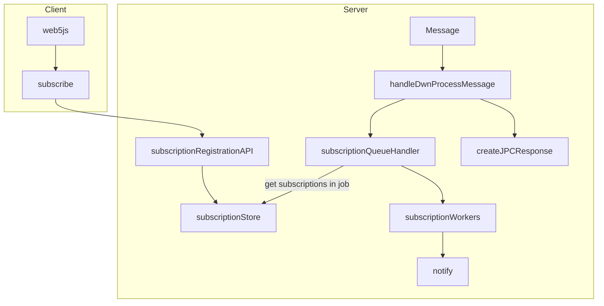

# TP19 Subscription Functionality

```yaml
TP: 19
Title: TP19 - Subscription Functionality
Authors: Andor Kesselman (@andorsk)
Comments URI: https://github.com/TBD54566975/technical-proposals/discussions/6
Status: Proposed
Created: August 16, 2023
Updated: August 16, 2023
```

## Problem Statement

In the context of a Distributed Web Node (DWeb Node or DWN), the goal is to
provide a seamless and responsive user experience for both local and remote
subscriptions. This involves enabling users to subscribe to DWN instances,
whether owned by themselves or by others.

**Example:**

Consider a chat application utilizing DWeb Nodes. When a user sends a message to
a DWeb Node, all participants should receive notifications about the new message
and be able to retrieve a unique recordId associated with the newly created
record. This should have minimal latency, and be handled by a "push" rather than
"pull" mechanic.

This problem aims to ensure that subscribing to both local and remote DWeb Nodes
is user-friendly and functional, facilitating real-time interactions and data
retrieval.

## Proposal

* Use a socket connection to listen in 

## Questions and Considerations

* How can we re-use as filters across repositories to avoid redundancy and allow
  for better user experience?
* What is the right way to describe the subscription api?
* How do we insert code at the point of behind validation?
* Default behavior if no did is specified? 
* How do we ensure users can only subscribe to the right options?
* How do users control the subscriptions? What happens if there is a node with
  millions of subscriptions?

## Interfaces

### web5-js API updates

Expose the following API with the following options to web5-js.

```typescript
type SubscribeOptions = {
  filter: RecordsQueryFilter // take in a records query filter
  did?: string // target did to subscribe to
}

web5.dwn.subscribe(opts: SubscribeOptions, async (message) => {
  // TODO: add stuff here for callbakc handling
})
```

### DWN Server Updates

Insert code in
[handleDWNProcessMessage](https://github.com/TBD54566975/dwn-server/blob/main/src/json-rpc-handlers/dwn/process-message.ts#L9).
Message processing events should be sent to a subscription queue of some sort. 



### DWN-SDK-JS Updates


Insert code somewhere around the [processMessage](https://github.com/TBD54566975/dwn-sdk-js/blob/main/src/dwn.ts#L93C19-L93C19)

Similar behavior to DWN Server
