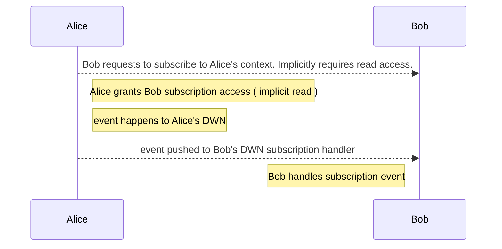
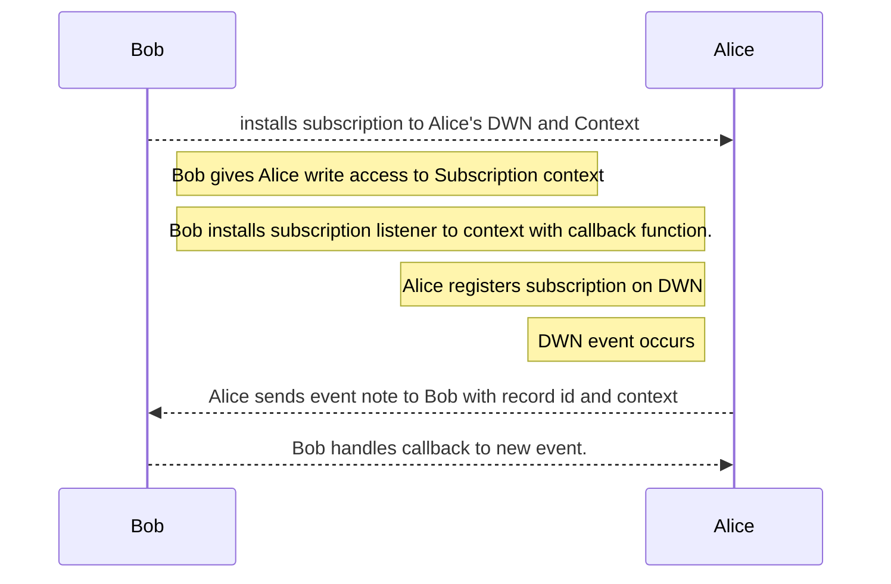
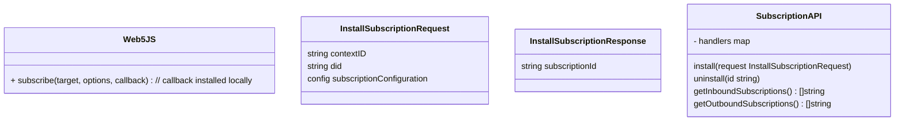
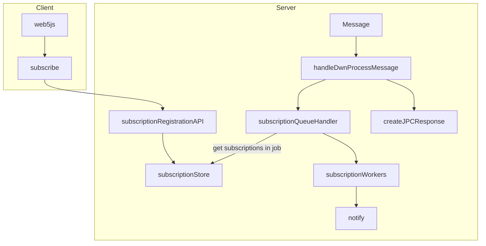

# TP19 Subscription Functionality

```yaml
TP: 19
Title: TP19 - Subscription Functionality
Authors: Andor Kesselman (@andorsk)
Comments URI: https://github.com/TBD54566975/technical-proposals/discussions/6
Status: Proposed
Created: August 16, 2023
Updated: August 16, 2023
```

## Problem Statement

In the context of a Distributed Web Node (DWeb Node or DWN), the goal is to
provide a seamless and responsive user experience for both local and remote
subscriptions. This involves enabling users to subscribe to DWN instances,
whether owned by themselves or by others.

**Example:**

Consider a chat application utilizing DWeb Nodes. When a user sends a message to
a DWeb Node, all participants should receive notifications about the new message
and be able to retrieve a unique recordId associated with the newly created
record. This should have minimal latency, and be handled by a "push" rather than
"pull" mechanic. 

This problem aims to ensure that subscribing to both local and remote DWeb Nodes
is user-friendly and functional, facilitating real-time interactions and data
retrieval.


## Higher Level Interaction

As an example of a higher level flow between Alice and Bob for subscriptions.



## Proposal

* Subscription API imply a wrapper ReadRecord interface with additional PUSH mechanics.
* Support two methods eventually: Web sockets and Web hooks

## Questions and Considerations

* How can we re-use as filters across repositories to avoid redundancy and allow
  for better user experience?
* What is the right way to describe the subscription api?
* How do we insert code at the point of behind validation?
* Default behavior if no did is specified? 
* How do we ensure users can only subscribe to the right options?
* How do users control the subscriptions? What happens if there is a node with
  millions of subscriptions?

## Interfaces

### web5-js API updates

Expose the following API with the following options to web5-js.

```typescript
type SubscribeOptions = {
  filter: RecordsQueryFilter // take in a records query filter
  did?: string // target did to subscribe to
}

web5.dwn.subscribe(opts: SubscribeOptions, async (message) => {
  // TODO: add stuff here for callbakc handling
})
```

## Subscription Hooks

In the context of the web hook paradigm, during an event update, only the
'recordId' is shared with Bob. The primary processing responsibility lies with
Alice. To ensure scalability, Alice will likely need to implement a queuing
mechanism for effectively routing signals to various DWN's.

Here's a clearer version of the steps you provided:

1. Bob initiates a request to establish a subscription on Alice's DWN for a specific context.
2. Alice has the option to either approve or reject the request.
3. If the request is approved, Alice proceeds to install the subscription onto
   her DWN. She then notifies Bob about the approval.
4. Subsequently, Bob sets up the subscription on his DWN. This subscription is
   designed to monitor a specific contextual event and trigger a callback
   function whenever a new write event occurs within that context.
5. The subscription is closely associated with a particular context within the
DWN. Any event, along with its associated sub-events, is managed through a
callback. If not customized, the default behavior of the callback is to write
the event to Bob's DWN.



The following shows the high level architecture for subscription



### DWN Server Updates

Insert code in
[handleDWNProcessMessage](https://github.com/TBD54566975/dwn-server/blob/main/src/json-rpc-handlers/dwn/process-message.ts#L9).
Message processing events should be sent to a subscription queue of some sort. 



### DWN-SDK-JS Updates


Insert code somewhere around the [processMessage](https://github.com/TBD54566975/dwn-sdk-js/blob/main/src/dwn.ts#L93C19-L93C19)

Similar behavior to DWN Server
