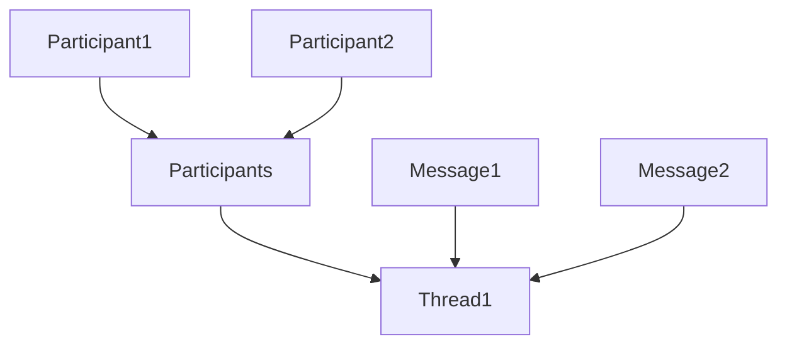
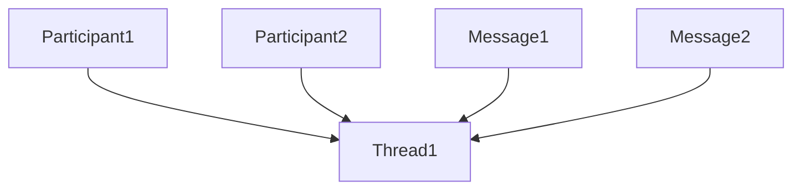
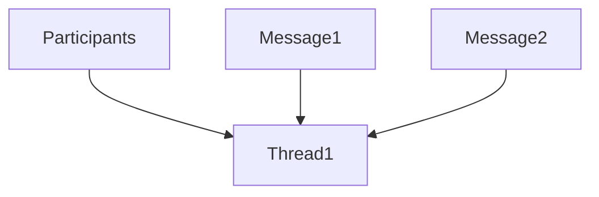

# TP24 Participant Authorization in Protocols

```yaml
TP: 24
Title: TP24 - Participant Authorization in Protocols
Authors: Henry Tsai (@thehenrytsai)
Comments URI: https://github.com/TBD54566975/technical-proposals/discussions/5
Status: Draft
Created: May 23, 2023
Updated: May 23, 2023
```

## Problem Statement
We need a protocol mechanism for enabling multi-party communication such as group chat.

## Possible Approaches
Assuming we need to explicitly declare participants, there are a few ways to model it using `RecordsWrite`, using chat as an example:

1. A `participants` "container" record which is referenced by `participant` child records.



2. Direct `participant` child records with out the "container". Pro: we can dogfood protocol rules for managing participants.



3. One `participants` record that contain the list of participants.




## Proposal
Use approach #2

Example protocol definition:

```json
{
  "protocol": "http://chat-protocol.xyz",
  "types": {
    "thread": {
      "schema": "http://thread.xyz",
      "dataFormats": [
        "application/json"
      ]
    },
    "message": {
      "schema": "http://message.xyz",
      "dataFormats": [
        "application/json"
      ]
    },
    "$comment": "Below is implied and need not be specified, but shown for demonstrating the intent",
    "$participant": {
      "schema": "http://participant.tbd",
      "dataFormats": [
        "application/json"
      ]
    }
  },
  "thread": {
    "$participant": {
      "$actions": [
        {
          "who": "participant",
          "of": "tread",
          "can": "write"
        },
        {
          "who": "participant",
          "of": "tread",
          "can": "query"
        },
        {
          "who": "participant",
          "of": "tread",
          "can": "delete"
        }
      ]
    },
    "message": {
      "$actions": [
        {
          "who": "participant",
          "of": "tread",
          "can": "write"
        },
        {
          "who": "participant",
          "of": "tread",
          "can": "query"
        }
      ]
    }
  }
}
```

## Open Questions
1. Should the `$participant` data be embedded directly within the message like the placement of protocol definition? If so, this would differ from the pattern used by a pure record currently.

1. How can we prevent a participant from modifying their past records after they are removed?

Probably through the usage of the "snapshot" feature to be spec-ed in a separate Technical Proposal, which would be useful in general, as well as when revoking a permission.

