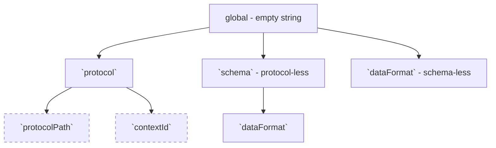
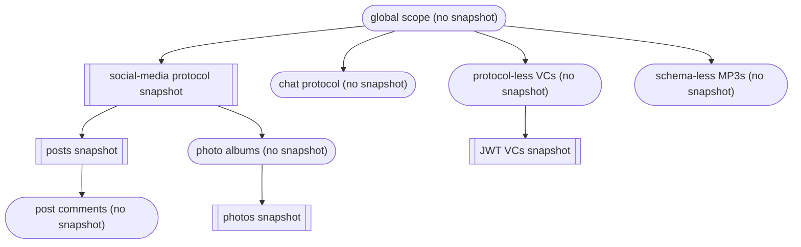

# TP25 Snapshots for DWeb Nodes

```yaml
TP: 25
Title: Snapshots for DWeb Nodes
Author(s): Henry Tsai (@thehenrytsai)
Comments URI: https://github.com/TBD54566975/technical-proposals/discussions/
Status: Draft
Created: June 5, 2023
Updated: June 5, 2023
```

## Problem Statement

Currently, if an entity is granted write access to a DWeb Node but later has that access revoked, the entity can still write to the DWeb Node by manipulating the timestamp of messages to be earlier than the revocation time.


## Proposal

Implement a mechanism that allows the owner to capture a 'snapshot' of the state of all records within a specific scope at a particular time. This snapshot would serve to discard any messages with timestamps earlier than the snapshot but not included in it.

A snapshot will be created through a `SnapshotsCreate` message, an example of the message:

```json
{
  "descriptor": {
    "interface": "Snapshots",
    "method": "Create",
    "dateCreated": "2023-06-05T11:22:33.445566Z",
    "scope": "protocols/<protocolUri>/<protocolPath>",
    "dataCid": "<CID of data containing CIDs of all messages in the snapshot"
  },
  ...
}
```

The payload will simply contain a list of message CIDs, a potential structure:

```json
[
  "<CID1>",
  "<CID2>",
  "<CID3>",
  ...
]
```

### Scoping

In order to minimize complexity of `SnapshotsCreate` processing, the snapshot `scope` property must have a value that maps to one of the allowed positions in the logical tree structure below:



1. `"scope": "" | undefined`

   This means the snapshot is taken at a global scope. ie. any message not included in the snapshot is deleted.

1. `"scope": "protocols/<protocolUri>"`

   Messages under a particular protocol.

1. `"scope": "protocols/<protocolUri>/path/<protocolPath>"`

   Messages under a particular protocol path under a protocol.

1. `"scope": "protocols/<protocolUri>/context/<contextId>"`

   Messages under a particular context ID under a protocol.

1. `"scope": "schemas/<schemaUri>"`

   Non-protocol messages under a particular schema.

1. `"scope": "schemas/<schemaUri>/data-formats/<data-format>"`

   Non-protocol-based messages under a particular schema and data-format.
   Unsure of its practical use, this is mainly for illustration purpose.

1. `"scope": "data-formats/<data-format>"`

   Schema-less messages with a particular data format.

Example snapshots in a DWN:

- Round box - no snapshot defined
- Padded Square box - snapshot defined



1. Snapshot scope of `protocolPath` and `contextId` are the only two leaf scopes that are intersecting. That is, a message can simultaneously be referenced in a `protocolPath` scoped snapshot as well as a `contextId` scoped snapshot.

1. We only need to keep the newest snapshot of any given scope.

1. The intent of the prescribed scoping structure is to minimize the possible permutation of scopes a message can appear in. If we were to allow a more flexible scoping syntax, such as using filters, it would require a more complex or less efficient logic for maintaining the overall CID retention list .

1. A message that does not fall under the scope of any snapshot is not subject to snapshot authorization, thus MUST be kept.

### Scope Processing

General rules:

1. A newer snapshot erases all older snapshots with the same or a descendent scope. (e.g. a newer snapshot with "protocol X" scope overwrites all older snapshots with any "protocol path" scope under the same protocol)

1. A newer descendent snapshot overwrites retention of messages that falls under its (sub)scope in the parent snapshot. (e.g. a newer descendent snapshot with a `protocolX/pathSegment1/pathSegment2` scope overwrites retention of messages of a parent snapshot with scope `protocolX`)

Pseudo-code for `SnapshotsCreate` processing:
```typescript

// processing algorithm in a nutshell:
// maintain an aggregate retention list of CIDs (`this.finalRetentionList`) for quick snapshot-authorization evaluation
// 
// 0. determine if the incoming snapshot should be ignored or processed
// 1. first delete all the CIDs in the final retention list that came from snapshots with scope same as, or sub-scope of, the incoming snapshot scope, so that we can rebuild that section of the retention list 
// 2. delete all older snapshots with same or sub-scope, because a newer parent scope snapshot trumps any older snapshots with a sub-scope
// 3. update the final retention list by inserting the CIDs that need to be retained under the incoming snapshot scope; then
// 4. delete all DWN messages under the incoming snapshot scope (including sub-scopes) that are not in the retention list


// 0. determine if the incoming snapshot should be ignored or processed
const newerSnapshots = getNewerSnapshots(incomingSnapshot.timestamp);
for (const newerSnapshot of newerSnapshots) {
  if (newerSnapshot.scope.isParentScopeOf(incomingSnapshot.scope)) {
    return; // no need to process this snapshot
  }
}

// 1. delete all the CIDs in the final retention list that came from snapshots with scope same as, or sub-scope of, the incoming snapshot scope
//
// get all CIDs of retained in snapshots under the incoming snapshot scope (including sub-scopes), regardless of snapshot timestamp
// NOTE: logic for doing this may be optimized to look very similar to the recursive retention list computation
const snapshotsUnderIncomingSnapshotScope = getSnapshotsUnderScope(incomingSnapshot.scope);
const cidCandidatesForRemoval = getAllRetainedCidsInSnapshots(snapshotsUnderIncomingSnapshotScope);
for (const cid in cidCandidatesForRemoval) {
  // TODO: figure out how to efficiently obtain full scope info without fetching the message 
  const messageScope = getMessageFullScope(cid);
  // this is where we need to make sure we don't remove CIDs in the final retention list that are referenced by an external intersecting scope
  // ie. if incoming snapshot scope is `contextId` scoped,
  //     then we need to make sure we check the retention list of intersecting snapshots with `protocolPath` scope
  // eg. if a CID is being evaluated for deletion under the `contextId` scope and its `protocolPath` is `foo/bar/baz`,
  //     we need to check snapshots with `protocolPath` scope of `foo`, and `foo/bar`, and `foo/bar/baz`
  //     to make sure none of those snapshots attempts to retrain the same CID
  // TODO: requires more drilling into as it appears to be very costly
  const intersectingSnapshots = getIntersectingSnapshots(messageScope, incomingSnapshot.scope);
  for (const intersectingSnapshot of intersectingSnapshot) {
    const retainedInIntersectingSnapshot = intersectingSnapshot.includes(cid);
    if (retainedInIntersectingSnapshot) {
      continue; // can't remove the CID from the final retention list if it is being referenced by an intersecting snapshot
    }
  }

  // delete if not referenced in any snapshots with externally intersecting scopes
  this.finalRetentionList.delete(cid);
}


// 2. delete all older snapshots with same or sub-scope, because a newer parent scope snapshot trumps any older snapshots with a sub-scope
deleteOlderSnapshotsWithSameOrSubScope();

// computes the complete retention list at the scope of thd given snapshot
function updateRetentionList(currentSnapshot) {
  // NOTE: immediate newer descending snapshots do NOT have to have direct child scope
  const immediateNewerDescendingSnapshots = getImmediateNewerDescendingSnapshots(currentSnapshot);

  // NOTE: looping through the immediate descending snapshots can probably be after the looping of the CIDs in this snapshot below also
  for (const immediateNewerDescendingSnapshot in immediateNewerDescendingSnapshots) {
    updateRetentionList(immediateNewerDescendingSnapshot.scope);
  }
  
  for (const cid of currentSnapshot.cids) {
    // TODO: figure out how to efficiently obtain full scope info without fetching the message 
    const messageScope = getMessageFullScope(cid);

    if (immediateDescendingSnapshotsHaveAParentScopeOf(messageScope)) {
      continue; // a newer descendent snapshot overwrites retention list that falls under its (sub)scope.
    }

    // else
    this.finalRetentionList.push(messageCid);
  }
}

// 3. update the final retention list by inserting the CIDs that need to be retained under the incoming snapshot scope; then
updateRetentionList(incomingSnapshot);

// 4. delete all DWN messages under the incoming snapshot scope (including sub-scopes) that are not in the retention list
// NOTE: seems super expensive to iterate over all CIDs but unavoidable?!
const cidsUnderIncomingSnapshotScope = getCidsInDwnUnderScope(incomingSnapshot.scope);
this.storageController.deleteMessageAndDataUnlessInRetentionList(cidsUnderIncomingSnapshotScope, this.finalRetentionList);

```

Pseudo-code for snapshot authorization:
```typescript
// get newer snapshots
const newerSnapshots = getNewerSnapshots(incomingMessage.timestamp);

// if there is one newer snapshot with scope that the incoming message falls under, then we will need to snapshot-authorize it
const needSnapshotAuthorization = false;
for (const newerSnapshot of newerSnapshots) {
  if (newerSnapshot.scope.isSuperSetOf(incomingMessage.scope)) {
    needSnapshotAuthorization = true;
    break;
  }
}

if (!needSnapshotAuthorization) {
  return;
}

if (this.finalRetentionList.has(incomingMessage.cid)) {
  return;
}

// else
throw Error('Message failed snapshot-authorization.');

```

## Additional Considerations

1. Since this is a highly privileged operation, this TP suggests initially limiting access to the DID owner and potentially extending access to other actors later.

1. Sync will likely need to have awareness of Snapshots messages. Consider a scenario where a DWN receives a snapshot containing messages it does not (no longer) have:

    ```mermaid
    sequenceDiagram
        Alice->>DWN1: Snapshot1(ScopeX, CID1)
        Alice->>DWN2: Snapshot2(ScopeX, CID1, CID2)
        DWN1->>DWN2: Sync(Snapshot1)
        DWN2->>DWN2: Discard Snapshot1 since it is older than Snapshot2
        DWN2->>DWN1: Sync(Snapshot2)
        DWN1->>DWN1: Discovers message CID2 is needed but does not exist
        Note right of DWN1: Possible remedy:
        DWN1->>DWN2: Fetch(CID2)
        DWN2-->>DWN1: Message of CID2
    ```

   Consider an an extension to the scenario above, if message of `CID2` is removed after `Snapshot2` is taken and before sync of `Snapshot2`, DWN would not be able to fetch message of `CID2` even if it tries.

1. Would not make sense to allow scope to use mutable properties.

1. The the support for both "protocolPath" abd "contextId" in scope structure adds extra complexity.

1. The CID retention list construction needs the leaf-node scope of every message referenced in a snapshot by CID, while we can obtain this info by fetching the actual message for each CID, this approach is highly inefficient. We could require scope to be included for each CID in the snapshot for an instance lookup, but can we blindly trust the value given to us? This requires further thinking.

1. The deletion of messages does not take into account of their corresponding Record, this means an semantically valid but logically invalid list of CIDs can render the DWN in a corrupt state (e.g. containing only pruned initial `RecordsWrite` without subsequent `RecordsWrite` or `RecordsDelete`).

1. It is highly desirable for the snapshot scoping scheme to align with permission scoping and protocol hierarchy.

1. It does not make sense functionally and even potentially dangerous even to allow scopes that span across both protocol-authorized messages and protocol-less message.

1. It does not seem logical to permit the deletion of a snapshot once it is created for authorization purposes. If the snapshot is deleted, the DWeb Node will no longer be able to utilize the deleted snapshot to prevent unauthorized access.
