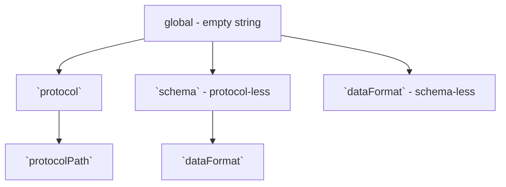

# TP25 Snapshots for DWeb Nodes

```yaml
TP: 25
Title: Snapshots for DWeb Nodes
Author(s): Henry Tsai (@thehenrytsai)
Comments URI: https://github.com/TBD54566975/technical-proposals/discussions/
Status: Draft
Created: June 5, 2023
Updated: June 5, 2023
```

## Problem Statement

Currently, if an entity is granted write access to a DWeb Node but later has that access revoked, the entity can still write to the DWeb Node by manipulating the timestamp of messages to be earlier than the revocation time.


## Proposal

Implement a mechanism that allows the owner to capture a 'snapshot' of the state of all records within a specific scope at a particular time. This snapshot would serve to discard any messages with timestamps earlier than the snapshot but not included in it.

The snapshot will be created be through `SnapshotsCreate` method, an example of the message:

```json
{
  "descriptor": {
    "interface": "Snapshots",
    "method": "Create",
    "dateCreated": "2023-06-05T11:22:33.445566Z",
    "scope": "protocols/<protocolUri>/<contextId>",
    "dataCid": "<CID of data containing CIDs of all messages in the snapshot"
  }
  ...
}
```

The payload will simply contain a list of message CIDs, a potential structure:

```json
[
  "<CID1>",
  "<CID2>",
  "<CID3>",
  ...
]
```

### Scoping

In order to optimize the efficiency of snapshot creation and message authorization against snapshots, a snapshot `scope` property can only have a value that maps to a position in the logical tree structure below:



1. `"scope": '' | undefined`

   This means the snapshot is taken at a global scope. ie. any message not included in the snapshot is deleted.

1. `"scope": 'protocols/<protocolUri>'`

   All messages under a particular protocol.

1. `"scope": 'protocols/<protocolUri>/<protocolPath>'`

   All messages under a particular protocol path under a protocol.

1. `"scope": 'schemas/<schemaUri>'`

   All non-protocol messages under a particular schema.

1. `"scope": 'schemas/<schemaUri>/data-formats/<data-format>'`

   All non-protocol-based messages under a particular schema and data-format.
   Unsure of its practical use, this is mainly for illustration purpose.

1. `"scope": 'data=formats/<data-format>'`

   All schema-less messages under a particular data format.

The intent of the prescribed scoping structure is to minimize the possible permutation of scopes a message can appear in by enforcing a message to appear in only one the hierarchy branch; if we allow a more free-formed scoping syntax (based on filters for example), we'd need to have a more complex include-list computation logic and/or iterate over many snapshots for:
   1. evaluating if a message under the scope a newly snapshot needs to be kept or removed; and
   1. authorizing a message.


It's important to realize that its not possible to create a single 'overall' include-list of message CIDs for authorization purposes, because the appropriate include-list varies based on the timestamp of the received message. As a result, we the include-list of message CIDs much be dynamically composed.

### Scope Processing

General rules:

1. A newer snapshot erases all older snapshots with the same or a descendent scope. (e.g. a newer snapshot with "protocol" scope overwrites all older snapshots with any "protocol path" scope under the same protocol)

1. A newer snapshot invalidates and overwrites messages that are under the same (sub)scope included in any older snapshot with an ancestral scope. (e.g. a newer snapshot with a "protocol path" scope invalidates and overwrites all messages that are under the same "protocol path" included in a parent "protocol" snapshot)

## Additional Considerations

1. Since this is a highly privileged operation, this TP suggests initially limiting it to the DID owner and potentially extending access to other actors later.

1. Sync will likely need to have awareness of Snapshots messages. Consider a scenario where a DWN receives a snapshot containing messages it does not (no longer) have:

    ```mermaid
    sequenceDiagram
        Alice->>DWN1: Snapshot1(ScopeX, CID1)
        Alice->>DWN2: Snapshot2(ScopeX, CID1, CID2)
        DWN1->>DWN2: Sync(Snapshot1)
        DWN2->>DWN2: Discard Snapshot1 since it is older than Snapshot2
        DWN2->>DWN1: Sync(Snapshot2)
        DWN1->>DWN1: Discovers message CID2 is needed but does not exist
        Note right of DWN1: Possible remedy:
        DWN1->>DWN2: Fetch(CID2)
        DWN2-->>DWN1: Message of CID2
    ```

1. It is apparent that snapshot scoping turns out to be quite "tailor-made" towards permission and protocol, so maybe it is really not practical to have a pure general purpose snapshot feature beyond the first 2 levels of scoping hierarchy.

1. The currently proposed structure falls short if there is a need to snapshot a specific protocol context (it's likely there are additional unsupported scenarios). We could introduce support for it under the "protocol" subtree, but that would violate the current design goal of "no intersecting message set in branches".

1. It is be extremely desirable if not necessary for the scoping scheme used in snapshot be compatible to permission scoping and protocol hierarchy, such that messages in a snapshots created can roughly match the scope of permission or path of a protocol feature toggle. It does not make sense functionally and dangerous even for example to allow a snapshot of both protocol-authorized and non-protocol-authorized Records messages with schema `x`. 

   If we allow intersecting scopes, it means we'd need to know the snapshot scopes each messages belongs in at any given time, so that we'd have necessary information when evaluating if a message should be kept or not due to a new snapshot being created. Furthermore, when authorizing a message against the snapshots, we'd need to iterate overall many/all snapshots.

1. It doesn't seem logical to permit the deletion of a snapshot once it's created for authorization purposes. If the snapshot is deleted, the DWeb Node will no longer be able to utilize the deleted snapshot to prevent unauthorized access.
