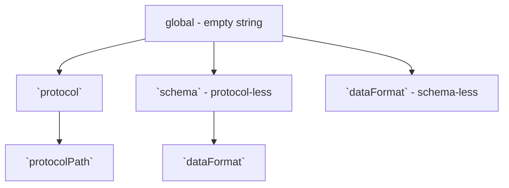

# TP25 Snapshots for DWeb Nodes

```yaml
TP: 25
Title: Snapshots for DWeb Nodes
Author(s): Henry Tsai (@thehenrytsai)
Comments URI: https://github.com/TBD54566975/technical-proposals/discussions/
Status: Draft
Created: June 5, 2023
Updated: June 5, 2023
```

## Problem Statement

Currently, if an entity is granted write access to a DWeb Node but later has that access revoked, the entity can still write to the DWeb Node by manipulating the timestamp of messages to be earlier than the revocation time.


## Proposal

Implement a mechanism that allows the owner to capture a 'snapshot' of the state of all records within a specific scope at a particular time. This snapshot would serve to discard any messages with timestamps earlier than the snapshot but not included in it.

The snapshot will be created be through `SnapshotsCreate` method, an example of the message:

```json
{
  "descriptor": {
    "interface": "Snapshots",
    "method": "Create",
    "dateCreated": "2023-06-05T11:22:33.445566Z",
    "scope": "protocols/<protocolUri>/<protocolPath>",
    "dataCid": "<CID of data containing CIDs of all messages in the snapshot"
  },
  ...
}
```

The payload will simply contain a list of message CIDs, a potential structure:

```json
[
  "<CID1>",
  "<CID2>",
  "<CID3>",
  ...
]
```

### Scoping

In order to optimize the efficiency of snapshot creation and message authorization against snapshots, a snapshot `scope` property can only have a value that maps to a position in the logical tree structure below:



1. `"scope": '' | undefined`

   This means the snapshot is taken at a global scope. ie. any message not included in the snapshot is deleted.

1. `"scope": 'protocols/<protocolUri>'`

   All messages under a particular protocol.

1. `"scope": 'protocols/<protocolUri>/<protocolPath>'`

   All messages under a particular protocol path under a protocol.

1. `"scope": 'schemas/<schemaUri>'`

   All non-protocol messages under a particular schema.

1. `"scope": 'schemas/<schemaUri>/data-formats/<data-format>'`

   All non-protocol-based messages under a particular schema and data-format.
   Unsure of its practical use, this is mainly for illustration purpose.

1. `"scope": 'data-formats/<data-format>'`

   All schema-less messages under a particular data format.

We only need to keep newest snapshot of any given scope.

The intent of the prescribed scoping structure is to minimize the possible permutation of scopes a message can appear in by enforcing a message to appear in only one the hierarchy branch. if we allow a more free-formed scoping syntax (based on filters for example), we'd need to have a more complex include-list computation logic and/or iterate over many snapshots for:
   1. evaluating if a message under the scope a newly snapshot needs to be kept or removed; and
   1. authorizing a message.


Note that there may not be a single 'overall' include-list of message CIDs for authorization purposes, because snapshots can be taken with scopes that have no intersection. (e.g. snapshot A with protocol X scope and snapshot B with schema-less data format Y scope)

### Scope Processing

General rules:

1. A newer snapshot erases all older snapshots with the same or a descendent scope. (e.g. a newer snapshot with "protocol" scope overwrites all older snapshots with any "protocol path" scope under the same protocol)

1. A newer descendent snapshot overwrites inclusion of messages that falls under its (sub)scope in the parent snapshot. (e.g. a newer descendent snapshot with a `protocolX/pathSegment1/pathSegment2` scope overwrites inclusion of messages of a parent snapshot with scope `protocolX`)

Pseudo-code for `SnapshotsCreate` handling:
```typescript

// figure out if this snapshot should be ignored or processed
const newerSnapshots = getNewerSnapshots(incomingSnapshot.timestamp);
for (const newerSnapshot of newerSnapshots) {
  if (newerSnapshot.scope.isSuperSetOf(incomingSnapshot.scope)) {
    return; // no need to process this snapshot
  }
}

// delete all CIDs that falls under the scope of the incoming snapshot so we can repopulate that subsection correctly
// an alternate strategy is to iterate overall all CIDs under the scope and remove as needed, but that seems less efficient
deleteAllCidsUnderScope(incomingSnapshot.scope);

// const inclusionList = new Map<string, string>; // CID -> scope map

// computes the complete inclusion list at the scope of thd given snapshot
function computeInclusionList(currentSnapshot) {
  // NOTE: immediate descending snapshots do NOT have to have direct child scope
  const immediateDescendingSnapshots = getImmediateDescendingSnapshots(currentSnapshot);
  for (const immediateDescendingSnapshot in immediateDescendingSnapshots) {
    computeInclusionList(immediateDescendingSnapshot.scope);
  }
  
  for (const cid of currentSnapshot.cids) {
    const messageScope = getMessageFullScope(cid); // consideration: opportunity for optimization

    if (immediateDescendingSnapshots.scopes.hasSuperSetOf(messageScope)) {
      continue; // a newer descendent snapshot overwrites inclusion of messages that falls under its (sub)scope.
    }

    // else
    // `finalInclusionList` is the in-memory global inclusion list that also stores the concise scope (for optimization)
    this.finalInclusionList.set(messageCid, messageScope);
  }
}

computeInclusionList(incomingSnapshot);

// delete all messages that are not in the inclusion list
const cidsUnderIncomingSnapshotScope = getCidsUnderScope(incomingSnapshot.scope);
this.storageController.deleteMessageAndData(cidsUnderIncomingSnapshotScope);

```

## Additional Considerations

1. Since this is a highly privileged operation, this TP suggests initially limiting it to the DID owner and potentially extending access to other actors later.

1. Sync will likely need to have awareness of Snapshots messages. Consider a scenario where a DWN receives a snapshot containing messages it does not (no longer) have:

    ```mermaid
    sequenceDiagram
        Alice->>DWN1: Snapshot1(ScopeX, CID1)
        Alice->>DWN2: Snapshot2(ScopeX, CID1, CID2)
        DWN1->>DWN2: Sync(Snapshot1)
        DWN2->>DWN2: Discard Snapshot1 since it is older than Snapshot2
        DWN2->>DWN1: Sync(Snapshot2)
        DWN1->>DWN1: Discovers message CID2 is needed but does not exist
        Note right of DWN1: Possible remedy:
        DWN1->>DWN2: Fetch(CID2)
        DWN2-->>DWN1: Message of CID2
    ```

1. It is apparent that snapshot scoping turns out to be quite "tailor-made" towards permission and protocol, so maybe it is really not practical to have a pure general purpose snapshot feature beyond the first 2 levels of scoping hierarchy.

1. The currently proposed structure falls short if there is a need to snapshot a specific protocol context (it's likely there are additional unsupported scenarios). We could introduce support for it under the "protocol" subtree, but that would violate the current design goal of "no intersecting message set in branches".

1. The CID inclusion list construction requires the most concise scope of every message referenced in a snapshot by CID, while we can obtain the info by fetching the actual message per CID, this approach is highly inefficient. We could require scope to be included for each CID in the snapshot for an instance lookup, but can we blindly trust the value given to us? This requires further thinking.

1. The deletion of messages does not take into account of their corresponding Record, this means an semantically valid but logically invalid list of CIDs can render the DWN in a corrupt state (e.g. containing only pruned initial `RecordsWrite` without subsequent `RecordsWrite` or `RecordsDelete`).

1. It is be extremely desirable if not necessary for the scoping scheme used in snapshot be compatible to permission scoping and protocol hierarchy, such that messages in a snapshots created can roughly match the scope of permission or path of a protocol feature toggle.

1. It does not make sense functionally and dangerous even to allow scopes that cuts across both protocol-authorized messages and protocol-less message.

1. It doesn't seem logical to permit the deletion of a snapshot once it's created for authorization purposes. If the snapshot is deleted, the DWeb Node will no longer be able to utilize the deleted snapshot to prevent unauthorized access.
