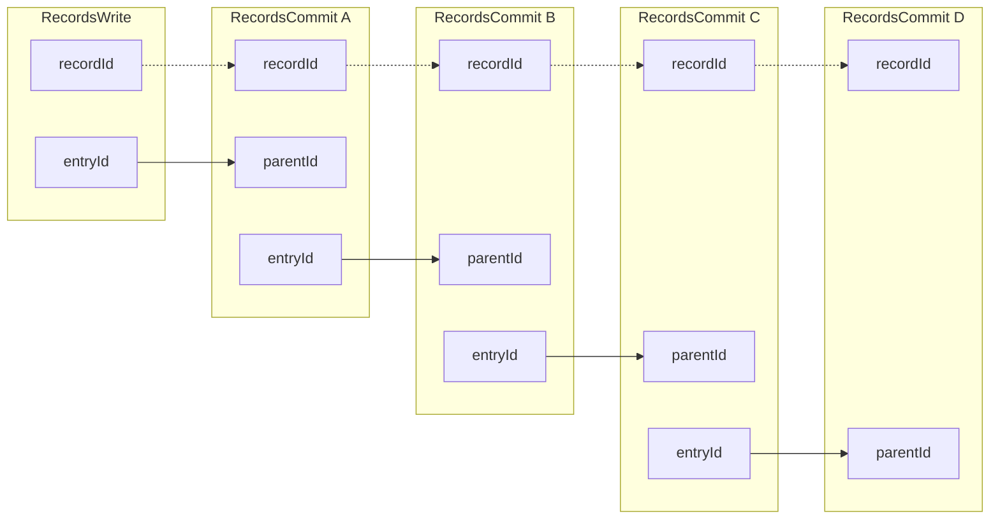
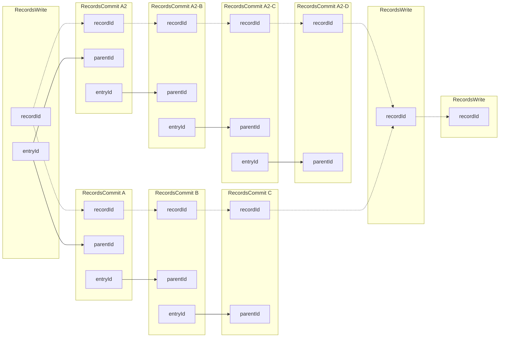

# TP27 RecordsCommit Interface

```yaml
TP: 27
Title: RecordsCommit Interface
Comments URI: TODO
Status: Draft
Created: July 21, 2023
Updated: July 25, 2023
```


## Context

Original references to DWN Spec:
- [RecordsCommit Interface](https://github.com/decentralized-identity/decentralized-web-node/blob/6226410bdc8ed702a6c93a3c5db90311e89e11b1/spec/spec.md#recordscommit)
- [RecordsCommit Processing](https://github.com/decentralized-identity/decentralized-web-node/blob/6226410bdc8ed702a6c93a3c5db90311e89e11b1/spec/spec.md#if-the-message-is-a-recordscommit)

The `RecordsCommit` interface will allow the DWN to update records within a multi-writer environment.

Currently two [Commit Strategies](#commit-strategies) are supported

## Lifecycle

The general lifecycle of a `RecordsCommit` will follow these steps:

- Create a `RecordsWrite` and set the `commitStrategy` descriptor field to one of the supported commit strategies.
- Subsequent updates to this record can be either `RecordsWrite` or `RecordsCommit`.
  - `RecordsCommit` message must have the following:
    - `recordId` that MUST be the `recordId` of the logical record the entry corresponds with.
    - `parentId` that MUST be `entryId` of the previous `RecordsWrite` or `RecordsCommit` ancestor in the record's lineage.
  - `RecordsWrite` message:
    - MAY set a new `commitStrategy`
    - purges all previous `RecordsCommit` messages
    - creates a new starting point for subsequent `RecordsCommit` messages.
- `RecordsRead` will still return a `RecordsWrite` as it does today.
  - If `commitStrategy` is set you MAY preform a `RecordsQuery` to get a list of the commits which build on top of the `RecordsWrite` parent.
- `RecordsQuery` without an additional `method` filter will return both `RecordsWrite` and `RecordsCommit` messages so that you can build up the current state of a record.
  - Consider adding a `commitRoot` filter to `RecordsQuery` that will help querying all the `RecordsCommit` messages beginning at a `entryId` onward.
  - Should this be a `RecordsCommitQuery` or some other separate type of query message for commits?


## Considerations
- If the server receives a `RecordCommit` that doesn't match it's current state it will ignore it. If it is behind it will catch up via `sync`. 
- If receiving multiple `RecordsCommit` messages which point to the same `parentId`, keep all of the potential tree paths until a `RecordsWrite` is made.
- Many commits could require a lot of storage and bandwidth.
- Some static methods from the `RecordsWrite` class can be generalized and moved to the `Records` helper class.

## Discussion Questions
- Should `published` only be modifiable at the `RecordsWrite` message level?
- How will this work with DataStreams?
- Some properties are required for key derivation for each `RecordsCommit` message are copies from the root `RecordsWrite` message: `schema`, `protocol`, `protocolPath`, `contextId`, `dataFormat`.
  - Should these properties be explicit within the `RecordsCommit` descriptor?
    - This would allow a bare `UnsignedRecordsCommitMessage` to have all of the info it needs to create the signatures without any need to access any other messages.
    - **Although it currently doesn't have any conflict, if this is the route we go we should be careful of `parentId` as it's used differently between the two descriptors(Write and Commit).
- Within the multi-writer `RecordsCommit` context, what responsibilities does the DWN have vs the Web5 SDK vs general application layer logic?


## Examples
#### Simple Example

#### Branch & Consolidate Example

## Permissions
Protocol permissions for these messages are derived from the `RecordsWrite` message.

Explicit grants can be created for `RecordsCommit`(??)

## Messages
### RecordsWrite
There is now an optional field `commitStrategy` which can be set to one of the supported strategies. Once this field is set, subsequent `RecordsCommit` messages can be used to build on top of this message's state.
### RecordsCommit
A `RecordsCommit` allows an entity to create a tree of commits on top of a `RecordsWrite` using a given `commitStrategy`.

The `RecordsCommit` descriptor contains a `parentId` field which points to the deterministic [`entryId`](https://github.com/TBD54566975/dwn-sdk-js/blob/cb6b21f75d19a644f62231cf27bc154ed73dad0e/src/interfaces/records-write.ts#L438) of the preceding `RecordsCommit` or `RecordsWrite` message.

### RecordsQuery
The `RecordsQuery` message will now return both `RecordsWrite` and `RecordsCommit` messages unless a specific `method` is set in the descriptor. 

An additional `commitRoot` filter will be added. Setting this to an ancestor's `entryId` will return all subsequent `RecordsCommit` messages. ** this is a research item to see what this query looks like.


## Commit Strategies
From [DWN Spec](https://identity.foundation/decentralized-web-node/spec/#commit-strategies)
| Name | Key | Spec | Description |
|------|-----|------|-------------|
| JSON Patch | `json-patch` | [RFC 6902](https://datatracker.ietf.org/doc/html/rfc6902) | delta-based JSON document patching
| JSON Merge Patch | `json-merge` | [RFC 7386](https://datatracker.ietf.org/doc/html/rfc7386) | deep-merge modification strategy for JSON documents

## Type definitions
```typescript

type RecordsCommitDescriptor = {
  interface: 'Records';
  method: 'Commit';

  // the `entryId` of the of the previous `RecordsWrite` or `RecordsCommit` ancestor in the record's lineage.
  parentId: string;
  // matches the commitStrategy of the RecordsWrite. Is this needed here if it exists on the Write? mostly to prevent issues?
  commitStrategy: CommitStrategy;

  //from parent RecordsWrite used for key derivation:
  dataFormat: string;
  protocol?: string;
  protocolPath?: string;
  schema?: string;
  contextId?: string; // contextId dependency for key derivation will be removed in https://github.com/TBD54566975/dwn-sdk-js/pull/452/files#diff-93bec3b5cd4732dbf5e87a5cb6b93f9a4622f7f77ea48e8d79276591af3c42c8L129

  // standard message data
  dataCid: string;
  dataSize: number;
  messageTimestamp: string;
};

type RecordsCommitMessage = {
  // the record Id of the logical record
  recordId: string
  descriptor: RecordsCommitDescriptor;
  attestation?: GeneralJws;
  encryption?: EncryptionProperty;
  authorization?: GeneralJws;
};

enum CommitStrategy {
  JSONPatch = 'json-patch',
  JSONMerge = 'json-merge'
}

```