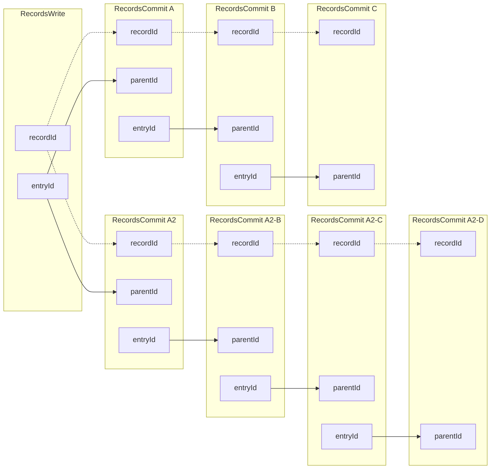

# TP27 RecordsCommit Interface

```yaml
TP: 27
Title: RecordsCommit Interface
Comments URI: TODO
Status: Draft
Created: July 21, 2023
Updated: July 21, 2023
```


## Context

Original references to DWN Spec:
- [RecordsCommit Interface](https://github.com/decentralized-identity/decentralized-web-node/blob/6226410bdc8ed702a6c93a3c5db90311e89e11b1/spec/spec.md#recordscommit)
- [RecordsCommit Processing](https://github.com/decentralized-identity/decentralized-web-node/blob/6226410bdc8ed702a6c93a3c5db90311e89e11b1/spec/spec.md#if-the-message-is-a-recordscommit)

The `RecordsCommit` interface will allow the DWN to update records within a multi-writer environment.

Currently two [Commit Strategies](https://identity.foundation/decentralized-web-node/spec/#commit-strategies) are supported.
  - [JSON Patch - RFC 6902](https://datatracker.ietf.org/doc/html/rfc6902)
  - [JSON Merge Patch - RFC 7386](https://datatracker.ietf.org/doc/html/rfc7386)

## Lifecycle

The general lifecycle of a `RecordsCommit` will follow these steps:

- Create a `RecordsWrite` and set the `commitStrategy` descriptor field to one of the supported commit strategies.
- Subsequent updates to this record can be either `RecordsWrite` or `RecordsCommit`.
  - `RecordsCommit` message must have the following:
    - `recordId` that MUST be the `recordId` of the logical record the entry corrosponds with.
    - `parentId` that MUST be the CID of the descriptor(`entryId`) of the previous `RecordsWrite` or `RecordsCommit` ancestor in the record's lineage.
  - `RecordsWrite` message:
    - MAY set a new `commitStrategy`
    - creates a new starting point for subsequent `RecordsCommit` messages.


## Considertions
 - Many commits could requuire a lot of storage and bandwidth.
 - Permissions/Protocol rules are inherated from the Write
 - Protocol/ProtocolPath should be present in `RecordsCommit` message descriptor to derive keys without access to the `RecordsWrite` parent.
 - All potential leaves of the tree are stored until a subsequent `RecordsWrite` is made.

## General Questions
 - How will this work with DataStreams?
 - Within the multi-writer `RecordsCommit` context, what responsibilities does the DWN have vs the Web5 SDK vs general application layer logic?
 - Potential For Querying:
    - `RecordsRead` and `RecordsQuery` will still return a `RecordsWrite` as they do today
    - If `commitStrategy` is set for the user SHOULD preform a `RecordsQueryCommits` to get a list of the commits which build on top of the `RecordsWrite` parent. 
    - Is there a better querying flow for data with Commits? 
      - `RecordsQuery` potentially returns both the `RecordsWrite` and `RecordsCommit` in one call if commits exist?
      - Index and Query Commits starting at a particular `parentId`?


## Examples
#### Simple Example

#### Branched Example
